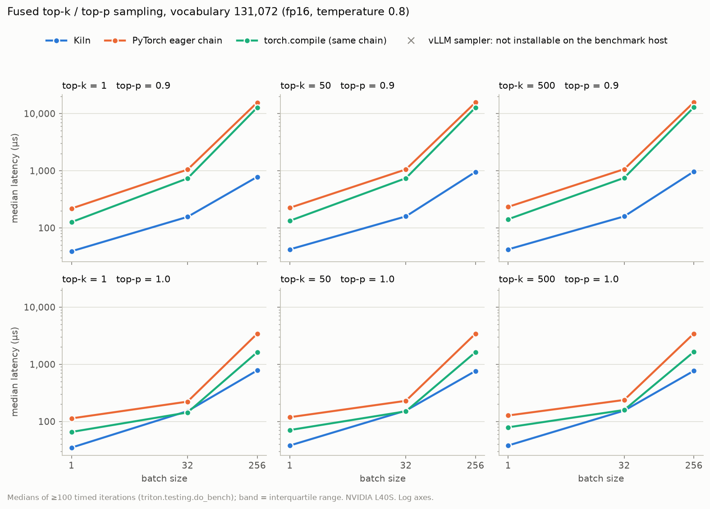
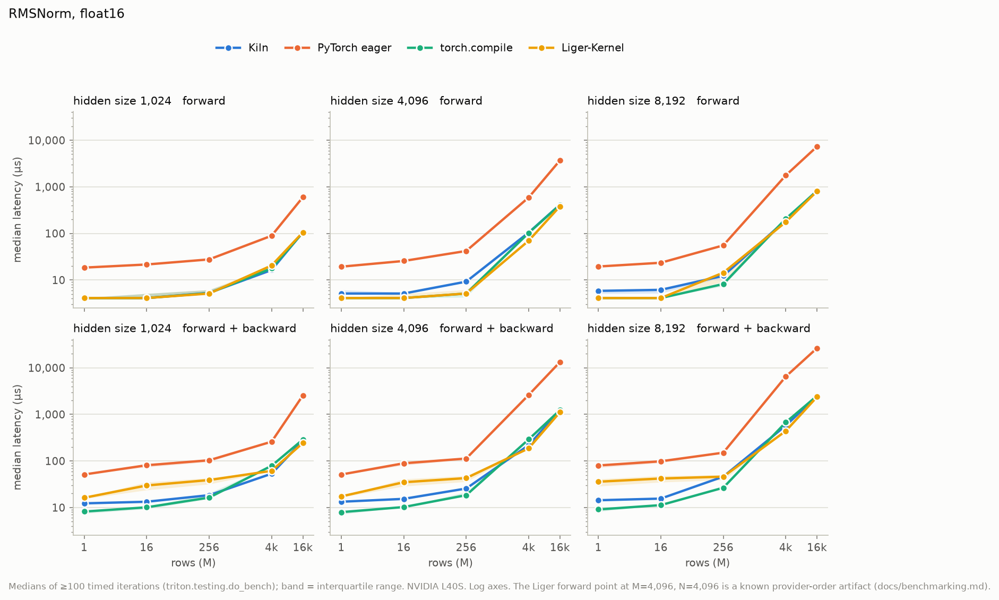

# Kiln

Two GPU kernels for large-language-model inference, written in Triton, plus a
CUDA C++ port of one of them. Each is tested against a plain PyTorch reference,
benchmarked against PyTorch eager, `torch.compile`, and the strongest library
kernel available, and profiled with Nsight Compute. The point of the project is
the measurement as much as the kernels: every number below can be regenerated
from raw timing data committed in this repository.

| Kernel | What it does | Where |
|---|---|---|
| `kiln.fused_topk_topp` | Temperature, top-k, softmax, top-p, renormalize, in one op. No sort. | `src/kiln/sampling.py` |
| `kiln.rmsnorm` | RMSNorm forward and backward, fused. | `src/kiln/rmsnorm.py` |
| `kiln.rmsnorm_cuda.rmsnorm_cuda` | The same RMSNorm as a CUDA C++ custom op, with autograd and `torch.compile` support. | `src/kiln/csrc/` |

All measurements are from one NVIDIA L40S (Ada, 142 SMs, 48 GB GDDR6, 96 MB L2),
CUDA 13.0, PyTorch 2.13.0, Triton 3.7.1, Liger-Kernel 0.8.0. Absolute times
would be lower on HBM parts such as the A100 or H100; ratios should transfer
better than absolutes.

## The headline number

Sampling the next token from a batch of 256 sequences over a 131,072-token
vocabulary (top-k = 50, top-p = 0.9, fp16):

| implementation | median latency |
|---|---:|
| PyTorch eager chain (`topk`, `sort`, `cumsum`, mask, `softmax`) | 15.6 ms |
| `torch.compile` of the same chain | 12.8 ms |
| **Kiln** | **0.95 ms** |

The fused kernel is 16x faster than eager and 13x faster than `torch.compile`,
and it does this while re-reading every logit roughly twenty times. The
baselines pay for a full sort of 131,072 columns per row. Kiln never sorts.
It finds the top-k threshold by binary search over the 16-bit encoding of the
logits, re-reading the row once per step to count how many values clear the
candidate. The same trick with a running probability mass finds the top-p
threshold. Those repeated passes are cheap because a batch of fp16 logits at
these shapes (64 MB) fits inside the L40S's 96 MB L2 cache, so the kernel is
bound by L2 latency rather than DRAM bandwidth. The profile confirmed it: DRAM
throughput under 1% of peak, L2 hit rate 97%.

## Install and use

Requires a CUDA GPU, Python 3.12+, and [uv](https://docs.astral.sh/uv/). The
CUDA port additionally needs `nvcc` on `PATH` (it is JIT-compiled on first import).

```bash
uv sync
uv run pytest            # 279 tests; skipped automatically without a CUDA device
```

```python
import torch
from kiln import fused_topk_topp, rmsnorm, RMSNorm

logits = torch.randn(32, 131072, device="cuda", dtype=torch.float16)
probs = fused_topk_topp(logits, k=50, p=0.9, temperature=0.8)   # float32 [32, V], rows sum to 1
next_token = torch.multinomial(probs, 1)

x = torch.randn(4096, 4096, device="cuda", dtype=torch.bfloat16, requires_grad=True)
norm = RMSNorm(4096).cuda().to(torch.bfloat16)
y = norm(x)                                                       # autograd works
y.sum().backward()

from kiln.rmsnorm_cuda import rmsnorm_cuda                       # CUDA C++ version, same semantics
y2 = rmsnorm_cuda(x, norm.weight)
```

The sampling op returns renormalized probabilities rather than sampled token
ids. Drawing is left to `torch.multinomial` so that the op itself is
deterministic and can be property-tested exactly. Its precise semantics,
including how ties at the k-th value and the top-p boundary are handled, are
specified in [docs/sampling_contract.md](docs/sampling_contract.md).

## Results

Medians over at least 100 timed iterations using `triton.testing.do_bench`.
Every raw replicate is in `bench/results/`; the tables below are copied from
the final runs there (`sampling_run5_iter3_final.json`, `rmsnorm_run4_final.json`).
Plots for the full matrix are in `bench/plots/`.

### Fused top-k / top-p sampling

fp16, k = 50, temperature 0.8, microseconds. The benchmark matrix was fixed
before any tuning began.

| vocab | batch | p | Kiln | eager chain | `torch.compile` | vs eager | vs compile |
|---:|---:|---|---:|---:|---:|---:|---:|
| 32,768 | 1 | 0.9 | 42 | 147 | 120 | 3.5x | 2.9x |
| 32,768 | 32 | 0.9 | 83 | 287 | 217 | 3.5x | 2.6x |
| 32,768 | 256 | 0.9 | 216 | 2,758 | 2,571 | 12.8x | 11.9x |
| 131,072 | 1 | 0.9 | 42 | 224 | 133 | 5.3x | 3.2x |
| 131,072 | 32 | 0.9 | 159 | 1,053 | 738 | 6.6x | 4.7x |
| 131,072 | 256 | 0.9 | 954 | 15,628 | 12,760 | 16.4x | 13.4x |
| 131,072 | 32 | 1.0 | 155 | 229 | 150 | 1.5x | 0.97x |
| 131,072 | 256 | 1.0 | 764 | 3,434 | 1,631 | 4.5x | 2.1x |

Across all 36 cases in the core matrix (batch 1/32/256, vocab 32k/128k,
k 1/50/500, p 0.9/1.0), Kiln is faster than eager everywhere (1.4x to 20x) and
faster than `torch.compile` in 34. The two exceptions are p = 1.0 at batch 32
and vocab 128k, where it lands at 0.95x and 0.97x.



Where it does not win, and why:

- **p = 1.0 is close to parity.** With top-p disabled the baselines skip their
  sort entirely, so both sides are doing little more than a softmax.
- **k = V and p = 1.0 loses (0.42x vs compile).** Both filters are no-ops and
  the whole op is a softmax. Inductor's single fused softmax kernel is the
  right tool for that; a kernel built around threshold searches is not.
- **fp32 is 3.5x over eager, not 16x.** The fast histogram path (below) is
  only exact for 16-bit dtypes, so fp32 uses the slower search path: 4.4 ms
  against 15.5 ms eager at batch 256, vocab 128k, k = 500.

### RMSNorm (Triton)

fp16, hidden size 4096, microseconds. Liger is [Liger-Kernel](https://github.com/linkedin/Liger-Kernel)'s Triton RMSNorm.

| rows | mode | Kiln | eager | `torch.compile` | Liger |
|---:|---|---:|---:|---:|---:|
| 256 | fwd | 9.2 | 42 | 5.1 | 5.1 |
| 4,096 | fwd | 104 | 591 | 102 | 70 * |
| 16,384 | fwd | 414 | 3,686 | 410 | 381 |
| 256 | fwd + bwd | 26 | 113 | 18 | 43 |
| 4,096 | fwd + bwd | 218 | 2,612 | 291 | 186 |
| 16,384 | fwd + bwd | 1,221 | 13,270 | 1,233 | 1,115 |

The expected picture for a well-trodden kernel: 6x to 12x over eager, and
parity with `torch.compile` and Liger once the problem is large enough to be
bandwidth-bound. At small row counts `torch.compile`'s generated kernel has a
lower fixed cost than Kiln's. Liger's backward is 10 to 15% faster at large
row counts (it writes `dx` in place into the `dy` buffer and uses a tuned
block-row scheme); Kiln's is faster at small ones.



\* The 70 µs entry is a measurement artifact, not a kernel gap. It is faster
than the DRAM roofline for this shape (67 MB of traffic at 864 GB/s is 78 µs).
Controlled interleaved A/B runs put Kiln and Liger forward at parity (103 vs
104 µs). Large memory-bound kernels on this machine are bimodal at roughly
104 and 71 µs depending on the process's allocation history, and the harness's
fixed provider order landed the two kernels in different modes. The biased
record is kept as recorded; the investigation is in
[docs/benchmarking.md](docs/benchmarking.md#provider-order-bias).

### RMSNorm (CUDA C++ port)

`torch.ops.kiln.rmsnorm_cuda`, registered through `TORCH_LIBRARY` with autograd
and fake-tensor support. Passes the same 115-test suite and tolerances as the
Triton version, `torch.library.opcheck` (schema, autograd, fake tensor, AOT
dispatch), and Compute Sanitizer memcheck with zero errors.

Two profiler-driven optimizations, each kept only after Nsight Compute showed
the predicted metric moving:

1. Two independent accumulators in the sum-of-squares loop, to expose more
   memory-level parallelism: eligible warps per scheduler 1.14 to 1.42, kernel
   79.9 to 72.6 µs.
2. `half2` loads and stores when `N` is even and all pointers are 4-byte
   aligned (scalar fallback otherwise): executed instructions 21.2M to 13.4M,
   DRAM throughput 534 to 657 GB/s, kernel 72.6 to 56.7 µs.

The forward finishes within about 10% of the Triton kernel and Liger; the
backward is about 30% slower than the Triton version, as a straightforward
three-launch port. Details in
[docs/rmsnorm_cuda_port.md](docs/rmsnorm_cuda_port.md).

## How the sampling kernel got fast

The full log, with profiles and per-iteration tables, is in
[docs/sampling_optimization.md](docs/sampling_optimization.md). The short
version:

**First version.** One Triton program per row. Find the min, max, and softmax
shift in one pass; bisect over the 16-bit key space to find the k-th value
(16 passes, each counting values above a candidate); one pass for the top-k
mass; bisect again for the top-p threshold (up to 16 passes summing mass);
two more passes to normalize and write. About 36 passes over the row for fp16.
Nsight Compute on batch 32, vocab 128k: DRAM 0.67% of peak, L2 hit rate 97.3%,
compute 10.6%, occupancy 16.7%, 0.05 waves per SM. The kernel was bound by
neither bandwidth nor compute. It was a chain of ~36 dependent L2 round trips
with too few warps to hide the latency.

**Iteration 1: fewer passes.** Replace each bisection with a 16-way search
(4 passes instead of 16 for fp16, 8 instead of 32 for fp32). Result: fp32 got
2.75x faster; fp16 got 2x *slower*. A 16-way pass costs about five times a
bisection pass because its 16 masked reductions serialize, so four heavy passes
lose to sixteen light ones. Kept for fp32, reverted for fp16. Adding an early
exit on already-converged search ranges gave fp16 another 1.2x to 1.35x.

**Iteration 2: a second algorithm for small batches.** At batch 1 the kernel
runs one program on one of 142 SMs. The histogram path instead splits each row
across up to 32 programs that build an exact 65,536-bin histogram of the row's
16-bit values with integer atomics. Both thresholds then come from two short
suffix scans over the histogram. Because every bin is exactly one
representable value, the probability mass of a bin is `count * exp(value)`, so
there are no floating-point atomics and the output is bit-for-bit
deterministic. Batch 1, vocab 128k: 573 to 205 µs.

**Iteration 3: the scan floor.** Per-kernel profiling showed one kernel, the
histogram threshold scan, taking 453 µs while everything else totaled 40 µs.
It walked 256 blocks of the histogram with a serially dependent accumulator.
Restructuring it to read the histogram as four wide tiles with a vectorized
suffix sum took batch 1, vocab 128k from 205 to 42 µs. That case had been the
project's worst loss (0.25x vs `torch.compile` in the first version) and is
now a 3.2x win.

The two paths share one contract and one test suite; dispatch between them is
by a measured crossover table (`_sampling_path`), with the marginal boundaries
deliberately excluded.

## What did not work

- **16-way search for fp16** (above). Predicted 3x from the pass count;
  measured 0.5x.
- **A weighted histogram** (accumulating `exp(value)` per bin directly) as the
  first cut of the small-batch path. Correct, but 2.7x slower than the plain
  sweep. The `count * exp(value)` reformulation replaced it.
- **Halving elements per warp in the Triton RMSNorm**, motivated by an
  occupancy gap in the profile. Zero change in `do_bench` medians; the kernel
  is DRAM-bound at the shapes that matter. Reverted.
- **A uniform warm-up at suite start** to remove the bimodal timing artifact in
  RMSNorm forward. Did not remove it. The artifact is handled by documenting it
  and drawing conclusions from interleaved A/B runs instead.

## Reproduce

On a machine with a CUDA GPU:

```bash
uv sync
uv run pytest                                      # 279 tests
uv run python bench/run_bench.py --suite all       # full matrix -> bench/results/*.json (about 30 min)
uv run python bench/run_bench.py --smoke           # 2 tiny cases per suite, to check the harness
uv run python bench/plot.py                        # regenerate bench/plots/ from bench/results/
```

Both sampling code paths can be forced for testing or benchmarking with
`KILN_SAMPLING_PATH=sweep` or `KILN_SAMPLING_PATH=hist`; the test suite runs
every case through both. The profiling launch target is
`bench/profile_sampling.py`.

## Repository layout

```
src/kiln/
  sampling.py          fused top-k/top-p: Triton kernels, dispatch, reference implementations
  rmsnorm.py           Triton RMSNorm fwd+bwd, autograd Function, nn.Module
  rmsnorm_cuda.py      CUDA custom op: JIT build, fake kernels, autograd registration
  csrc/rmsnorm_cuda.cu CUDA kernels and TORCH_LIBRARY registration
tests/                 279 tests: fixed tolerances, randomized property tests, sentinel/aliasing tests, opcheck
bench/
  cases.yaml           the benchmark matrix
  run_bench.py         runs it; writes one JSON per suite with every raw timing
  plot.py              regenerates plots from the JSON
  profile_sampling.py  launch target for Nsight Compute
  results/             raw data from every benchmark run, in order
  plots/               generated figures
docs/
  sampling_contract.md      exact operator semantics
  sampling_optimization.md  profiling and optimization log for the sampling kernel
  rmsnorm_cuda_port.md      the CUDA port's optimization log
  benchmarking.md           timing protocol, correctness protocol, known artifacts
```

## Scope and limitations

- One GPU model, one machine. Nothing here was tuned or measured on other
  hardware.
- The sampling op does not draw tokens; see the contract for why.
- vLLM's sampler was intended as a baseline but could not be installed on the
  benchmark host. Its rows appear in the results marked `unsupported` rather
  than being dropped.
- Row length is capped at 65,536 for RMSNorm (the whole row lives in
  registers) and the sampling kernels assume the vocabulary dimension is
  contiguous.
- Not a production inference component. There is no multi-GPU, quantization,
  or attention work here.
